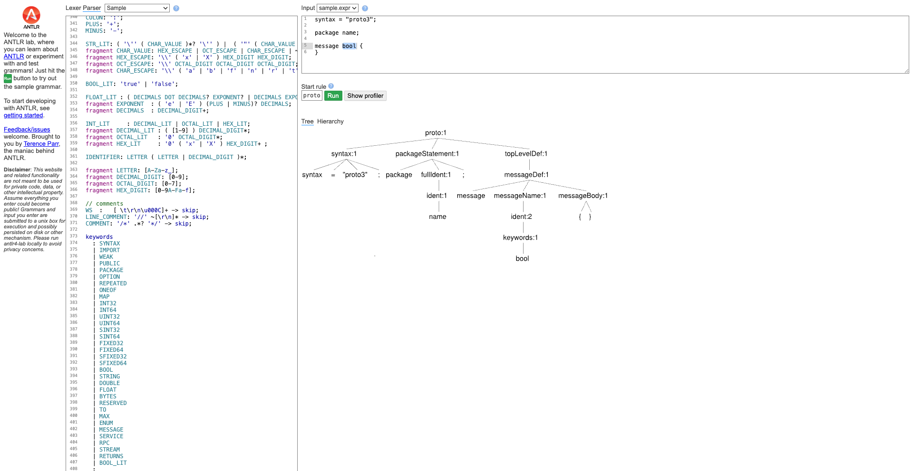

# Proto3 Integration To-Do

## JavaScript Support
- JS currently not supported.
  - Identify features to disable or override to prevent build/compilation errors for JS.
  - If JS support is required, duplicate code referencing the ANTLR parser (mainly completions) for the JS ANTLR library.

## AMF Integration
- Request AMF to expose the ANTLR parser (see `W-12042267/completion-draft-changes` in the antlr-ast repo).
  - If AMF cannot expose the parser, consider implementing an internal `.g4` grammar and parser. This would allow grammar customization for improved suggestions (e.g., prioritizing common types), at the cost of reduced adaptability to AMF changes.
- Investigate empty specs throwing `UnsupportedDomainForDocumentException` instead of reporting errors.
- Review the resolution pipeline (currently undefined); consider implementing an editing pipeline as in other modules. (AMF side)
- Assess linkage when resolution is available (may require new linking visitors for features like go-to/find/rename; not in current scope).
- Address error when defining a message without a package (throws `IndexOutOfBounds`). (AMF side)

## Completion
- Evaluate usefulness of the ANTLR structure for completions.
- Implement a basic snippet factory for core features.
- When available, check if AMF objects correlate meaningfully with the document.
- Assess if AMF lexicals help identify the most specific object.
- If AMF objects and approximate location can be determined, provide custom snippets/completions.
- Consider replacing token-by-token completion with a snippet repository, suggesting best-fit snippets (e.g., similar to AgentTopic structures).
- Explore chaining literal tokens to provide more relevant suggestions.
- Investigate extracting declarations from AMF to suggest alongside primitive types.

---

### Grammar Notes
- Most names and free text are defined as `indent`, which accepts not only any text but also a KEYWORD.
- This causes all keywords to be suggested where names are expected, resulting in invalid suggestions.
- Example:

  ```proto
  syntax = "proto3";

  package name;

  message bool {
  }
  ```

  This throws:
  ```
  missing Protobuf3 messageName
  ```

  However, the grammar treats `bool` as the `messageName` token:
  