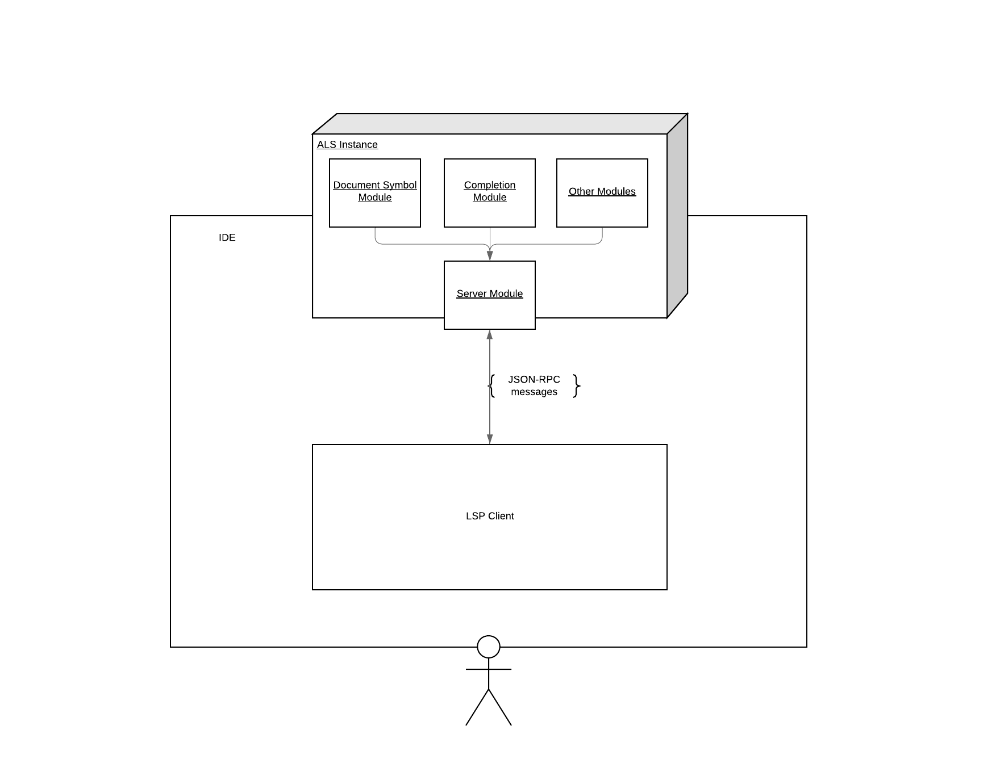
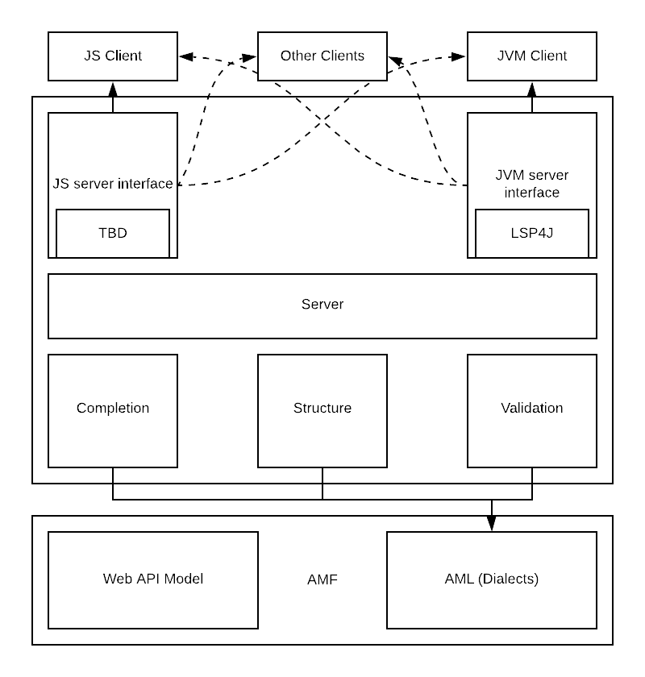

# How to contribute to ALS

First of all, thanks for taking the time to contribute! Review the following tips before you begin contributing to ALS.

## Contributing

### Overview
- Open a new GitHub pull request with the change. If you are contributing for the first time on a Salesforce project, you will be asked to sign the Salesforce CLA.
- Ensure that the PR description clearly describes the problem and the solution. Include the relevant issue number, if applicable.
- Before submitting, please read the [Code contributions](#code-contributions) section below to understand the technical contribution requirements.

### Did you find a bug?
- Ensure that the bug was not already reported by searching on GitHub under Issues.
- If you are unable to find an existing issue addressing the problem, open a new one. Be sure to include a title and clear description and provide as much relevant information as possible, and provide a code sample or an executable test case demonstrating the expected behavior.
- Include communication traces between the client and server (ALS), and the corresponding logs.

## Development setup

**Requirements:**
* Scala 2.12.11
* sbt 1.3.8
* NodeJS

Use the following commands to create a development setup:

Clone the repo:
```sh
$ git clone https://github.com/mulesoft/als.git
```

Generate a npm package (at `als/als-server/js/node-package/`):

```sh
$ sbt buildJsServerLibrary
```

Generate Java artifacts (at `als/als-server/jvm/target/scala-2.12/als-server-assembly-{VERSION}}.jar`):

```sh
$ sbt serverJVM/assembly
```

**Notes:**
- The .jar file generated above is the actual LSP server JAR.
- To run the JAR file from the client application, create a local socket and provide the port as a parameter. See the [ALS as a LSP Server](../readme.md#als-as-a-lsp-server) section of the README file to understand how the ALS interacts with the IDEs.
- The Javascript server implementation of the ALS is a work-in-progress and must be considered experimental.

### Version control branching
- Always branch from the `master` branch to ensure that you are up-to-date with the latest release.
- Do not submit unrelated changes in the same branch or pull request.
- If you need to update your branch because of the changes in the `master`branch, you must always **rebase**, not **merge**.
- You must always be up-to-date with the latest changes in `master`.

### Code formatting

The [Scalafmt](https://scalameta.org/scalafmt/) is used to format our code! Please format your code before opening a pull request.

### Running and writing tests

**Important**: Please include tests with any code contributions

We strongly recommend that you writing tests before you finally implement. 

To run tests, use the following command:
```sh
$ sbt test
```

#### Test coverage

Your contributions must comply with a minimum of 80% coverage rate.

To run a coverage report of the whole project, use the following command:
```sh
$ sbt clean coverage testJVM coverageReport
```

## Architecture

### ALS as a LSP Server
The AML Language Server (ALS) integrates different modules with specific objectives into one server module, which orchestrates functionalities while respecting the [Language Server Protocol (LSP)](https://microsoft.github.io/language-server-protocol/overview).



The server module communicates through a socket towards the client. To achieve this, the client must create a server socket and provide the selected port at the server initialization.



Thanks to the LSP architecture, the client is completely agnostic of the server language. This means that the `als-server.jar` can be used in a JS or Python plugin.

```sh
$ java -jar server.jar --port {XXXX}
```
The server connect to the provided socket during the initialization process `(localhost, {port})` (connection which the client must accept). Through this channel, the [LSP protocol](https://microsoft.github.io/language-server-protocol/specification) is respected. The server and client exchange information about accepted actions, and notifications or request might be triggered.

- [Features and modules](./features/features.md)
- [Navigation features](./features/navigation.md)
- [Eye-Candy features](./features/eyecandy.md)

### Internal dependency references
```
https://github.com/aml-org/amf
https://github.com/aml-org/amf-aml
https://github.com/aml-org/amf-core
https://github.com/aml-org/syaml
https://github.com/aml-org/scala-common
```
