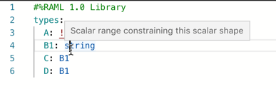
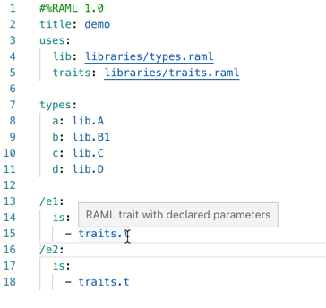
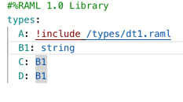
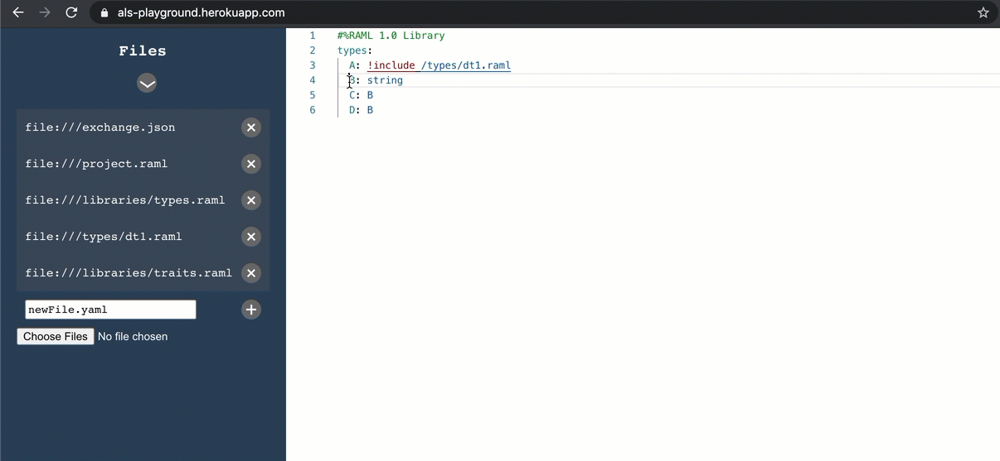
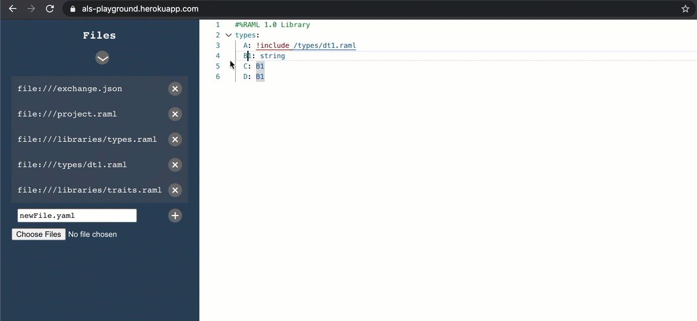

# Features and modules
## Eye-Candy features
###### The eye-candy classification refers to features that are focused on adding visual information or modifying the way the content is being viewed but doesn't change the actual content"

##### The following features are supported for eye-candy: Hover, Folding Ranges, and Rename.

### [Hover](https://microsoft.github.io/language-server-protocol/specification#textDocument_hover)

###### AML Vocabularies are used to extract a description for each field, with which LSP requests are populated for Hover.
### [Document Highlight](https://microsoft.github.io/language-server-protocol/specification#textDocument_documentHighlight)

###### Relationship graphs are used to detect and propagate each renaming action. You can further manage this with the "prepare rename" request (also provided).
### [Selection Range](https://microsoft.github.io/language-server-protocol/specification#textDocument_selectionRange)

###### Using the lexical information, LSP Selection Range Requests are provided on multiple cursors.
### [Folding Range](https://microsoft.github.io/language-server-protocol/specification#textDocument_foldingRange)

###### Using the  lexical information, LSP Folding Ranges Requests functionality is provided.
