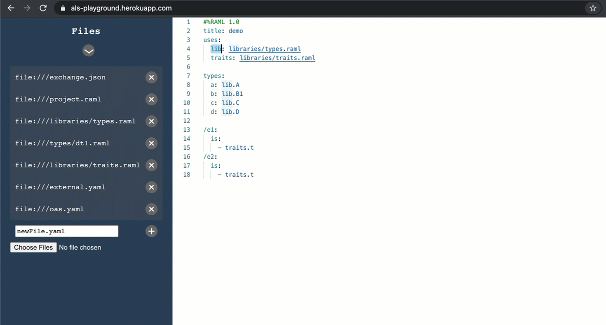

# Features and modules
## Eye-Candy features
##### We currently support the following features for eye-candy: Hover, Folding Ranges, Rename.
### [Hover](https://microsoft.github.io/language-server-protocol/specification#textDocument_hover)

###### We use AML Vocabularies to extract a description for each field, with which we populate LSP request for Hover.
### [Document Highlight](https://microsoft.github.io/language-server-protocol/specification#textDocument_documentHighlight)

###### We use our relationship graph to detect and propagate each renaming action. This can be further managed with the "prepare rename" request which we also provide.
### [Selection Range](https://microsoft.github.io/language-server-protocol/specification#textDocument_selectionRange)

###### Using our lexical information, we provide LSP Selection Range Request functionality on multiple cursors.
### [Folding Range](https://microsoft.github.io/language-server-protocol/specification#textDocument_foldingRange)

###### Using our lexical information, we provide LSP Folding Ranges Request functionality.