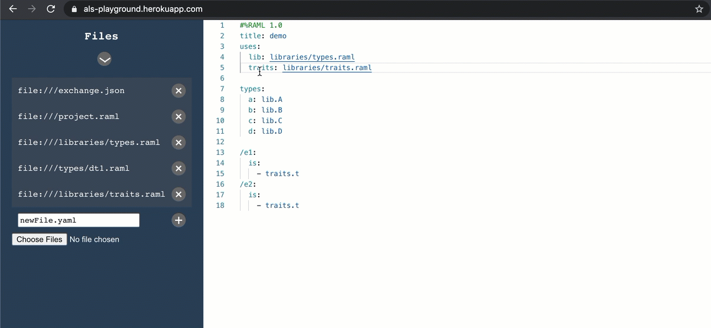
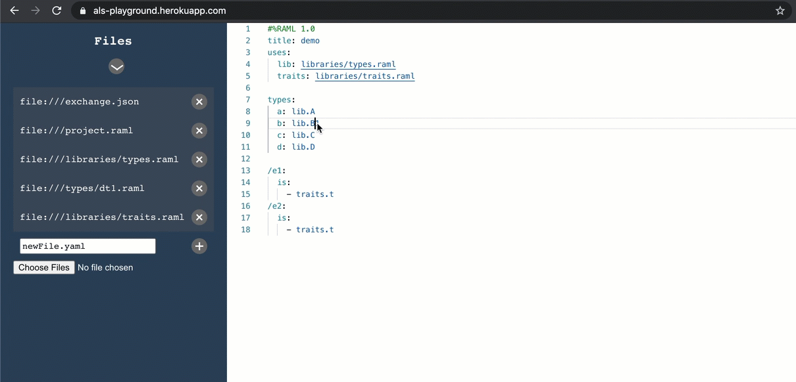
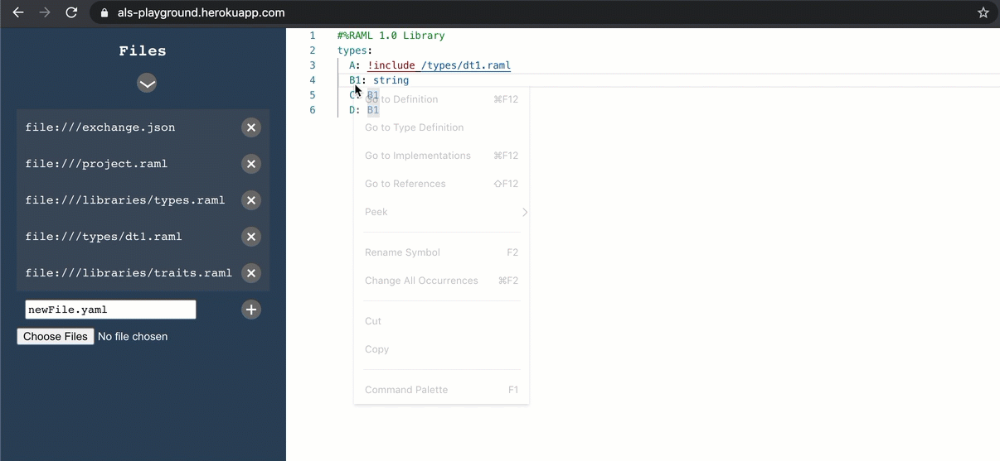

# Features and modules
## Navigation features
##### The LSP navigation messages that are currently supported include: Document Link, Go to Definition, Type Definition, Implementation, and Find References.
### [Document Link](https://microsoft.github.io/language-server-protocol/specification#textDocument_documentLink)

###### Each reference is detected to a whole file (without a specified target range) and is used to populate the LSP request for a given file document links.
### [Go to Definition](https://microsoft.github.io/language-server-protocol/specification#textDocument_definition)

###### Each link is detected between nodes, for example specific schemas, types, aliases, and so on. The LSP functionality is provided accordingly.
### [Go to Type Definition](https://microsoft.github.io/language-server-protocol/specification#textDocument_typeDefinition)

###### Template or implementation type relationships are detected, for example, RAML resource types and traits. The LSP functionality is provided accordingly.
###[Go to Implementation](https://microsoft.github.io/language-server-protocol/specification#textDocument_implementation)

###### Template or implementation type relationships are detected, for example, RAML resource types and traits. The LSP functionality is provided accordingly. This is an inverse reference as Go To Type Definiton.
### [Find Reference](https://microsoft.github.io/language-server-protocol/specification#textDocument_references)

###### Each link between nodes are detected, for example specific schemas, types, aliases, and so on. The LSP functionality is provided accordingly. This is an inverse reference as Go To Definiton
