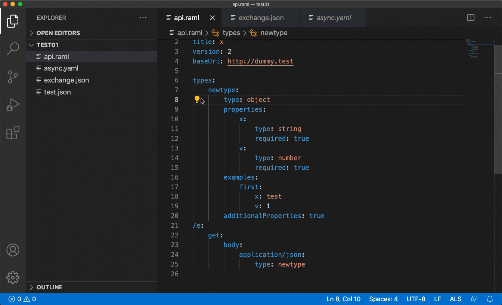

# Features and modules
## Refactor features
##### We currently support the following refactor features: Formatting, Text Formatting, And an increasing variety of Code Actions
### Formatting

### Range Formatting

### Rename

### File Rename
This is a custom method for ALS. Using this method you can rename a file and all it's references inside the project.

[more about this feature here](./custom-messages.md#renamefile)

### Code Actions
#### Extract Declaration

#### Extract to Fragment

#### Extract to Library

#### Extract Resource Type

#### Convert to Json Schema

#### Convert to Raml Type

#### Delete declaration

