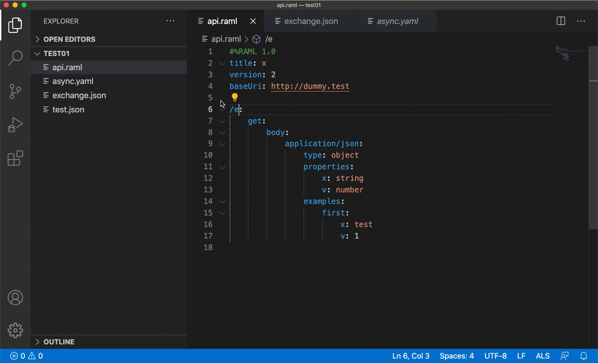

# Features and modules
## Refactor features
##### The refactor features currently supported include: Formatting, Text Formatting, and a variety of Code Actions.
### [Formatting](https://microsoft.github.io/language-server-protocol/specification#textDocument_formatting)

### [Range Formatting](https://microsoft.github.io/language-server-protocol/specification#textDocument_rangeFormatting)

### [Rename](https://microsoft.github.io/language-server-protocol/specification#textDocument_rename)

### [File Rename](./custom-messages.md#renamefile)
This is a [custom method](./custom-messages.md) for ALS. Using this method, you can rename a file and all its references inside the project.

### [Code Action](https://microsoft.github.io/language-server-protocol/specification#textDocument_codeAction)
#### Extract Declaration

#### Delete declaration

###### Code Actions just available for RAML at the moment:
#### Extract to Fragment

#### Extract to Library

#### Extract Resource Type or Trait

#### Convert to Json Schema

#### Convert to Raml Type

