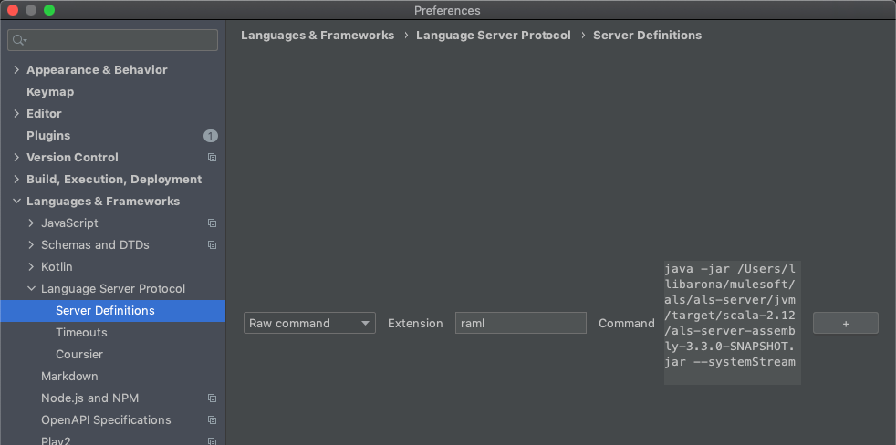
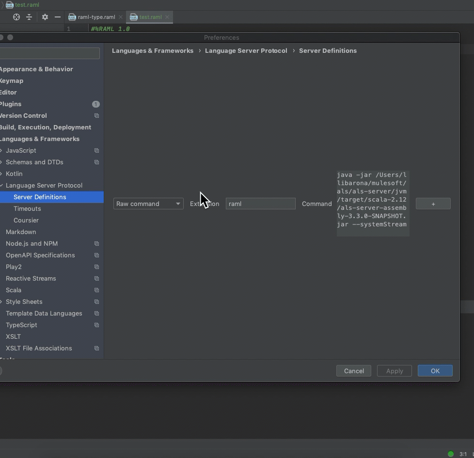

# IntelliJ ALS-Client
##### The following section demonstrates a quick example of how you can run the ALS as a pure LSP in IntelliJ
_This example requires the [ALS jar ready](../../readme.md#java-generation), Java 1.8 or newer in PATH, and [IntelliJ LSP Plugin](https://plugins.jetbrains.com/plugin/10209-lsp-support)._

### Steps

1. With the [IntelliJ LSP Plugin](https://plugins.jetbrains.com/plugin/10209-lsp-support) installed, go to `Preferences -> Languages & Frameworks -> Language Server Protocol -> Server Definitions`
2. Add a new server as a `Raw command`, select the required extension (in this example `raml`), and insert the following command: `java -jar /path/to/als-server.jar --systemStream`

_--systemStream parameter communicates using the standard input/output mechanism instead of sockets_.

### Running

