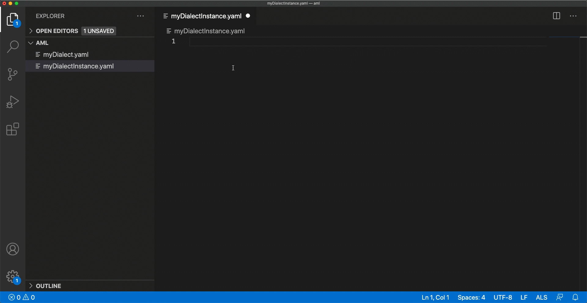

# AML - Register a Dialect
#### Register a dialect and start working on its custom instances
To register a new Dialect and enable tooling in its dialect instances, it is sufficient to open the Dialect file.

By receiving this `openFile`, ALS sends the dialect to AMF in order to parse and register it.

Once registered, you can work freely with any instance of this file for as long as this ALS instance is alive.

If you restart ALS, you will need to register the Dialect once again in order to get the desired tooling.

Keep in mind that each change in the dialect will impact on the fly in ALS.