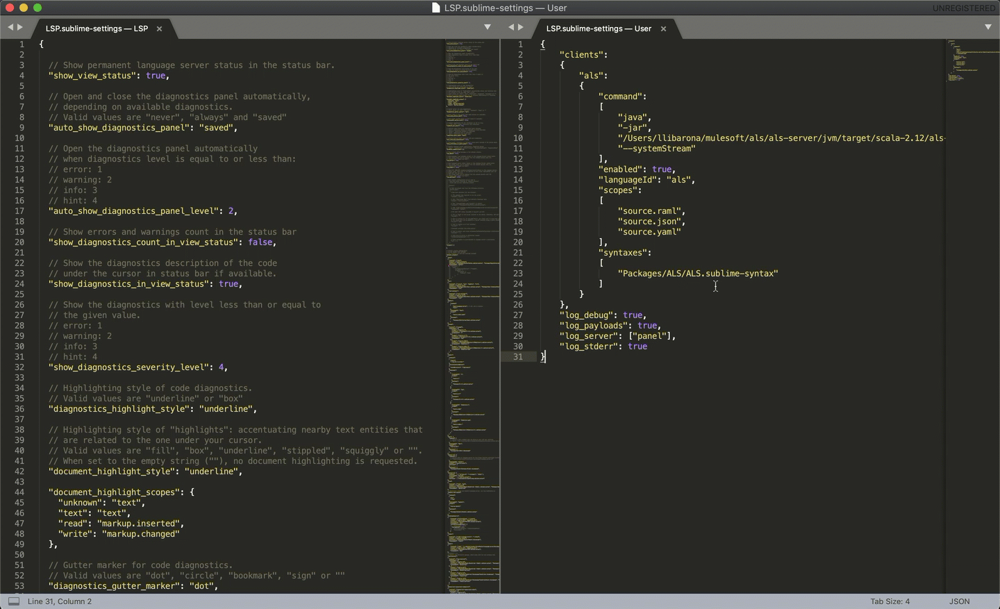

# Sublime Text 3 with ALS
##### The following section demonstrates a quick example on how you can run the ALS as a pure LSP in Sublime Text 3.
_This example requires the [ALS jar ready](../../readme.md#java-generation), Java 1.8 or newer in PATH, and Sublime 3 installed._
### Steps
- Download the LSP plugin for ST3: [instructions here](https://lsp.readthedocs.io/en/latest/#getting-started)
- Create a new sublime syntax by going to `Tools -> Developer -> New Syntax...`. The following fields are automatically set:
```yaml
name: ALS
file_extensions:
  - raml
  - json
  - yaml
  - yml
scope: source.raml
``` 
And save it (from now on `Packages/ALS/ALS.sublime-syntax`)


- Finally, add the server to the user's LSP settings by going to `Command Palette -> Preferences: LSP Settings` and adding the following node:
```json
{
	"clients":
	{
		"als":
		{
			"command":
			[
				"java",
				"-jar",
				"/path/to/als-server.jar",
				"--systemStream"
			],
			"enabled": true,
			"languageId": "als",
			"scopes":
			[
				"source.raml",
				"source.json",
				"source.yaml",
				"source.yml"
			],
			"syntaxes":
			[
				"Packages/ALS/ALS.sublime-syntax"
			]
		}
	},
	"log_debug": true,
	"log_payloads": true,
	"log_server": ["panel"],
	"log_stderr": true
}
```
_--systemStream parameter will have communication go through standard input/output instead of sockets_


### Running


