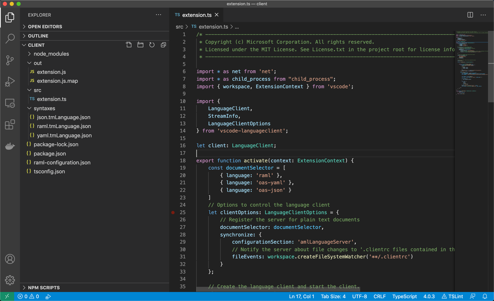
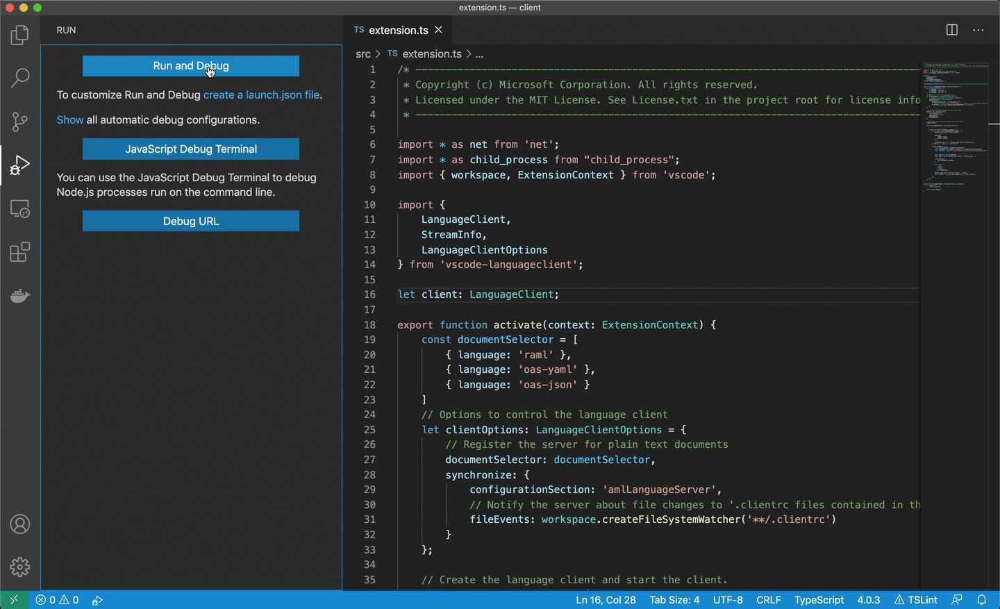

# VS Code ALS-Client
##### Here is a quick example on how you can run ALS as a pure LSP in Visual Studio Code
_This example requires having the [ALS jar ready](../../readme.md#java-generation), and Java 1.8 or newer in PATH._
### Steps
1. Download the LSP Client template from Microsofts github [repository](https://github.com/microsoft/vscode-extension-samples): https://github.com/microsoft/vscode-extension-samples/tree/master/lsp-sample/client
2. Replace the server options for ALS server in `./src/extension.ts.md` (see [extension.ts.md](#extension) for macOS/Linux, [extension.windows.ts.md](#extension) for Windows)
3. Add syntaxes (in this example, we will be adding them on `./syntaxes/*` [syntaxes](#syntaxes))
4. Add configuration file (in this example, `./raml-configuration.json` ([configuration](#configuration-file))
5. Configure `package.json` for new extension ([package.json](#packagejson))
6. `npm install` & `npm run compile` to generate `./out/extension.js`
7. `F5` to start debugging the new extension
8. [Have fun!](#running)

### Example files
#### Extension
We will adjust the [`./src/extension.ts.md`](./extension.ts.md). Keep in mind that you need to put the correct path instead of `'/path/to/als-server.jar'`

First, we need to create the socket through which both server and client will communicate.

Having this socket, we ask for the corresponding port, in order to inform als-server where to connect.

With this port we can spawn a new process using `java -jar /path/to/als-server.jar --port {OUR PORT NUMBER}`.

Having our server up&running we only need to give this information to the existing client.

#### Configuration file
This is just a quick instruction on how to read our `raml` documents.

In this example we will create `./raml-configuration.json` containing the most basic configuration:
```json
{
    "comments": {
        "lineComment": "//",
        "blockComment": [ "/*", "*/" ]
    },
    "brackets": [
        ["{", "}"],
        ["[", "]"],
        ["(", ")"]
    ],
    "autoClosingPairs": [
        ["{", "}"],
        ["[", "]"],
        ["(", ")"],
        ["\"", "\""],
        ["'", "'"]
    ],
    "surroundingPairs": [
        ["{", "}"],
        ["[", "]"],
        ["(", ")"],
        ["\"", "\""],
        ["'", "'"]
    ]
}
```

#### Package.json
Here we need to add some configuration for the vscode extension, some dependencies and some webpack instructions
```json
{
    "name": "aml-vscode",
    "displayName": "AML support",
    "description": "",
    "publisher": "MuleSoft",
    "version": "1.1.0",
    "engines": {
        "vscode": "^1.43.0"
    },
    "categories": [
        "Programming Languages"
    ],
    "main": "./out/extension",
    "activationEvents": [
        "onLanguage:raml"
    ],
    "contributes": {
        "languages": [
            {
                "id": "raml",
                "aliases": [
                    "ALS",
                    "als"
                ],
                "extensions": [
                    ".raml",
                    ".yaml",
                    ".yml",
                    ".json"
                ],
                "configuration": "./raml-configuration.json"
            }
        ],
        "grammars": [
            {
                "language": "raml",
                "scopeName": "source.raml",
                "path": "./syntaxes/raml.tmLanguage.json"
            }
        ],
        "configuration": {
            "title": "AML Language Server configurations",
            "properties": {
                "amlLanguageServer.trace.server": {
                    "scope": "window",
                    "type": "string",
                    "enum": [
                        "off",
                        "messages",
                        "verbose"
                    ],
                    "default": "verbose",
                    "description": "Traces the communication between VS Code and the language server."
                }
            }
        }
    },
    "dependencies": {
        "upath": "^1.2.0",
        "vsce": "^1.81.1",
        "vscode-languageclient": "^6.1.3",
        "webpack": "^4.44.1"
    },
    "devDependencies": {
        "@types/node": "^11.15.20",
        "@types/vscode": "1.43.0",
        "ts-loader": "^8.0.1",
        "typescript": "^3.9.7",
        "webpack-cli": "^3.3.12"
    },
    "scripts": {
        "compile": "tsc",
        "vscode:prepublish": "webpack --mode production",
        "webpack": "webpack --mode development",
        "webpack-dev": "webpack --mode development --watch",
        "test-compile": "tsc -p ./"
    }
}
```
_Having `amlLanguageServer.trace.server` turned to `verbose` will allow us to see the communication between server and client, under `Output -> AML Language Server`_

#### Syntaxes
We will create our basic raml syntax:
* [./syntaxes/raml.tmLanguage.json](./syntaxes/raml.tmLanguage.json)

### Running

