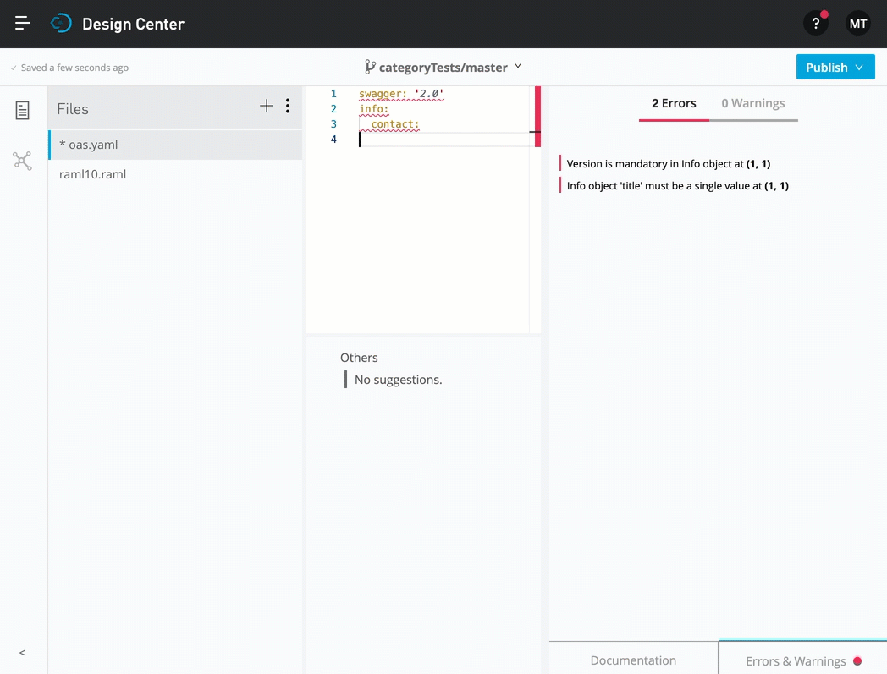
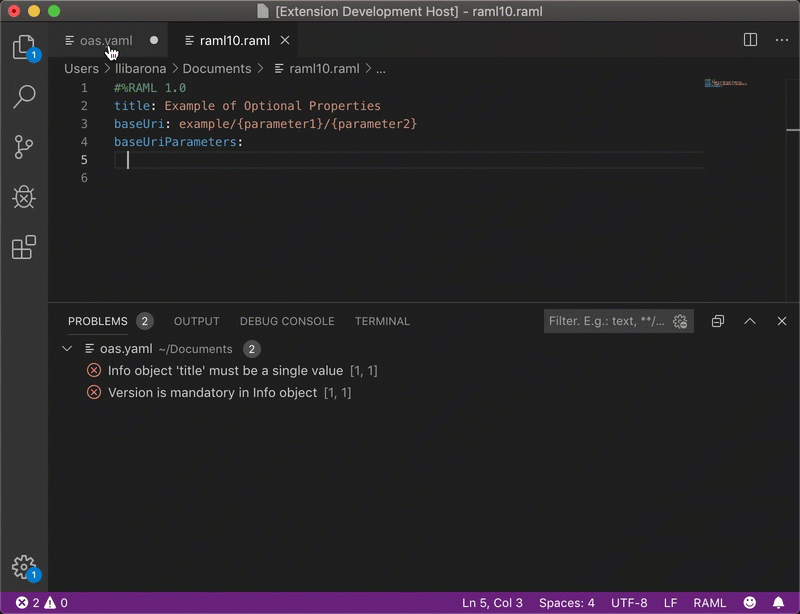
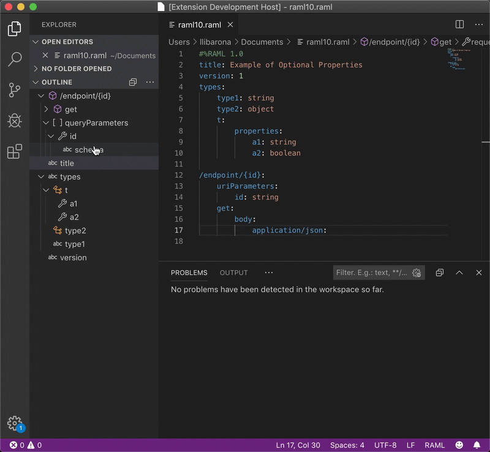

# AML Language Server
[](https://jenkins.build.msap.io/job/ALS/job/als/job/master/)

## Overview
This section explains what is ALS, how does it work, who should use it, and how is ALS used today.

### What is ALS?
The AML Language Server (ALS) is an implementation of the [Microsoft Language Server Protocol (LSP)](https://microsoft.github.io/language-server-protocol) with a primary focus towards API tooling and API specifications, such as RAML, OpenAPI, and AsyncAPI. The objective of the ALS is to simplify API development by relying on the LSP to support API specifications in as many integrated development environments (IDEs) as possible. Besides API tooling and API specifications, you can extend the ALS to support any type of documents.

The supported types of documents include:
+ [RAML](https://github.com/raml-org/raml-spec/blob/master/versions/raml-10/raml-10.md) (0.8 and 1.0)
+ [OpenAPI](https://github.com/OAI/OpenAPI-Specification/blob/master/versions/3.0.0.md) (2.0 and 3.0)
+ [AsyncAPI](https://github.com/asyncapi/asyncapi/blob/master/versions/2.0.0/asyncapi.md) (2.0)
+ [Any other type of documents via AML dialect](https://aml-org.github.io/aml-spec/dialects/) (1.0)
    - [How to register a dialect](./documentation/register-dialect.md)
+ [JsonSchema](https://json-schema.org/specification.html)
  - [Draft-04](https://json-schema.org/specification-links.html#draft-4)
  - [Draft-07](https://json-schema.org/specification-links.html#draft-7)
  - [Draft-2019-09](https://json-schema.org/specification-links.html#draft-2019-09-formerly-known-as-draft-8)

### What does ALS do?
The ALS relies on the [Anything Modeling Language (AML)](https://a.ml/docbook/overview_aml.html), more specifically on AML's [dialect](https://aml-org.github.io/aml-spec/dialects/) functionality. The ALS uses the AML to provide language server functionalities, such as validation, for the documents (also referred to as "instances" or "instance documents"). The ALS can also deduce possible contextual values at any given position of an instance document.

Using the representation of an API in a model, you can generate an outline or [Document Symbol](https://microsoft.github.io/language-server-protocol/specification#textDocument_documentSymbol) to render a more visual abstraction of an instance.

### Who should use ALS?
The ALS is the answer for you if you are interested in authoring specification documents, including out-of-the-box API specification documents (API definitions), but also any custom document using AML's dialect functionality, using your favorite IDE. Additionally, developers can use the ALS to create IDE plugins based on the LSP.

### What relies on ALS today?
Today, the ALS is used in MuleSoft Anypoint Design Center and in [Anypoint Studio](https://www.mulesoft.com/platform/studio) to provide feedback when authoring API definitions. You can see a [preview](#previews) in the following section.


## Getting started
This section explains how to use the ALS as a language server.

### Using ALS as a language server
The ALS can run as a standalone language server that you can use with any IDE. Most modern IDEs either natively support the LSP or provide a way to support the LSP using a plugin.

You can download the ALS server JAR using curl:

```shell
$ curl https://repository-master.mulesoft.org/nexus/content/repositories/releases/org/mule/als/als-server_2.12/3.x.x/als-server_2.12-3.x.x.jar -o als-server.jar
```

and then ran independently like so:

```shell
$ java -jar als-server.jar --port <port name>
```

### Adapting Microsoft LSP example for VSCode
You can adapt the [Microsoft VSCode LSP example](https://github.com/microsoft/vscode-extension-samples/tree/master/lsp-sample/client) by following [these instructions](./documentation/vscode-client-example/vscode-howto.md), which guides you to successfully run an ALS client in VSCode.

### Other examples
Here are some examples of how to use the ALS with other IDEs:
- [VS Code extension](./documentation/vscode-client-example/vscode-howto.md): instructions on how to plug ALS into the VSCode LSP client
- [Sublime Text 3 extension](./documentation/sublime-3-example/st3-howto.md): instructions for plugin ALS into ST3 LSP client   
- [IntelliJ extension](./documentation/intellij-example/intellij-howto.md): instructions for plugin ALS into IntelliJ's LSP client
- [Java LSP4J](./documentation/java-client-example/client.md): example on how to connect to a LSP server in Java using LSP4J, which can then be used for connecting IDE features to a plugin

### Previews
This sections illustrates previews of different IDEs.

#### Anypoint Design Center example:


#### Visual Studio Code completion example (LSP):


#### Visual Studio Code document symbol example (LSP):

****

## Other considerations
This section explains how the LSP is supported in ALS.

### LSP support in ALS
The [Language Server Protocol (LSP)](https://microsoft.github.io/language-server-protocol/overview) is a tooling standardization for IDEs that defines a client-server architecture used to abstract a general implementation of used language-specific smarts.

In this client-server architecture, the server works as a standalone (write once with consistent behaviour) functionality provider. With this server, the client (each IDE plugin) independently understands the LSP messaging and communication, agnostic of the server implementation.

#### Currently supported LSP features
Currently, the following LSP capabilities are supported:
##### [Basic features](./documentation/features/features.md)
+ [Completion](https://microsoft.github.io/language-server-protocol/specification#textDocument_completion)
+ [Document Symbol](https://microsoft.github.io/language-server-protocol/specification#textDocument_documentSymbol)
+ [Diagnostics](https://microsoft.github.io/language-server-protocol/specification#textDocument_publishDiagnostics)

##### [Navigation features](./documentation/features/navigation.md)
+ [Find Reference](https://microsoft.github.io/language-server-protocol/specification#textDocument_references)
+ [Goto Definition](https://microsoft.github.io/language-server-protocol/specification#textDocument_definition)
+ [Goto Type Definition](https://microsoft.github.io/language-server-protocol/specification#textDocument_typeDefinition)
+ [Goto Implementation](https://microsoft.github.io/language-server-protocol/specification#textDocument_implementation)
+ [Document Link](https://microsoft.github.io/language-server-protocol/specification#textDocument_documentLink)

##### [Refactor features](./documentation/features/refactor.md)
+ [Prepare Rename](https://microsoft.github.io/language-server-protocol/specification#textDocument_prepareRename)
+ [Rename](https://microsoft.github.io/language-server-protocol/specification#textDocument_rename)
+ [Code Action](https://microsoft.github.io/language-server-protocol/specification#textDocument_codeAction)
+ [Formatting](https://microsoft.github.io/language-server-protocol/specification#textDocument_formatting)
+ [Range Formatting](https://microsoft.github.io/language-server-protocol/specification#textDocument_rangeFormatting)

##### [EyeCandy features](./documentation/features/eyecandy.md)
+ [Document Highlight](https://microsoft.github.io/language-server-protocol/specification#textDocument_documentHighlight)
+ [Folding Range](https://microsoft.github.io/language-server-protocol/specification#textDocument_foldingRange)
+ [Hover](https://microsoft.github.io/language-server-protocol/specification#textDocument_hover)
+ [Selection Range](https://microsoft.github.io/language-server-protocol/specification#textDocument_selectionRange)


#### Currently extended features (not defined in LSP)
Besides LSP messages, we also support other custom operations, which are detailed [here](./documentation/features/custom-messages.md)

## Contributing
If you are interested in contributing to this project, ensure that you read our [contributing guidelines](./documentation/CONTRIBUTING.md).
