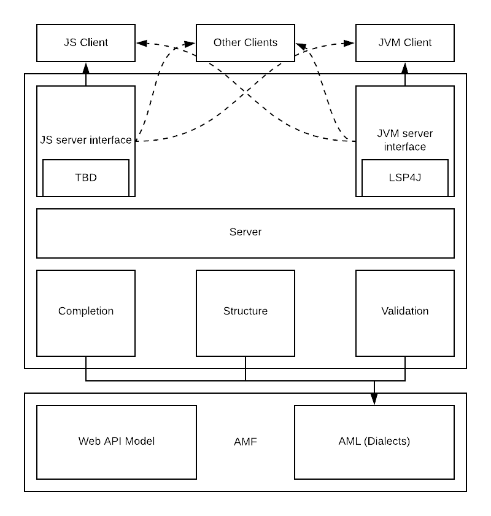

# AML Language Server
[](https://jenkins.build.msap.io/job/ALS/job/als/job/master/)
## Overview
### What is ALS?
AML Language Server (ALS for short), is our implementation of [Microsoft's Language Server Protocol (LSP)](https://microsoft.github.io/language-server-protoco) targeted towards API tooling.

The objective is to fully support IDE tooling, in order to ease API development. Not only that, but also eventually enable to define a custom dialect, and provide out of the box tooling for it's instance definitions.

#### About API Models (AML/AMF)
ALS uses [Anything Modeling Language (AML)](https://a.ml/docbook/overview_aml.html) capability to define a [Dialect](https://aml-org.github.io/aml-spec/dialects/) used to define it's instances.
Using this Dialect we are able to validate and deduce possible values given a position in the instance document.

Also, using this representation of the API in a Model, we are able to generate an outline or [Document Symbol](https://microsoft.github.io/language-server-protocol/specification#textDocument_documentSymbol) to give a more visual abstraction of the Instance.
 
##### Out of the box accepted definitions

+ [RAML](https://github.com/raml-org/raml-spec/blob/master/versions/raml-10/raml-10.md) (0.8 and 1.0)
+ [OpenAPI](https://github.com/OAI/OpenAPI-Specification/blob/master/versions/3.0.0.md) (2.0 and 3.0)
+ [AsyncAPI](https://github.com/asyncapi/asyncapi/blob/master/versions/2.0.0/asyncapi.md) (AsyncApi 2.0)
+ [Dialects](https://aml-org.github.io/aml-spec/dialects/) (AML)

###### playground for als-features at: https://als-playground.herokuapp.com/

### About LSP
[Microsoft's Language Server Protocol (LSP)](https://microsoft.github.io/language-server-protocol/overview), is a tooling standardization for IDEs, which defines a Client-Server architecture used to abstract a general implementation of used language-specific smarts.

The idea behind this Client-Server architecture, is that the Server works as a standalone (write once and always behave the same) functionality provider.

With this server, it's up to the client (each IDE plugin) to just understand LSP messaging and communicate, agnostic of the server implementation.

#### Currently supported LSP features
Currently, we support the following LSP capabilities:
+ [Completion](https://microsoft.github.io/language-server-protocol/specification#textDocument_completion)
+ [DocumentSymbol](https://microsoft.github.io/language-server-protocol/specification#textDocument_documentSymbol)
+ [Diagnostics](https://microsoft.github.io/language-server-protocol/specification#textDocument_publishDiagnostics)
+ [PrepareRename](https://microsoft.github.io/language-server-protocol/specification#textDocument_prepareRename)
+ [Rename](https://microsoft.github.io/language-server-protocol/specification#textDocument_rename)
+ [Find Reference](https://microsoft.github.io/language-server-protocol/specification#textDocument_references)
+ [Goto Definition](https://microsoft.github.io/language-server-protocol/specification#textDocument_definition)
+ [Goto Type Definition](https://microsoft.github.io/language-server-protocol/specification#textDocument_typeDefinition)
+ [Goto Implementation](https://microsoft.github.io/language-server-protocol/specification#textDocument_implementation)
+ [DocumentLink](https://microsoft.github.io/language-server-protocol/specification#textDocument_documentLink)
+ [Document Highlight](https://microsoft.github.io/language-server-protocol/specification#textDocument_documentHighlight)
+ [Folding Range](https://microsoft.github.io/language-server-protocol/specification#textDocument_foldingRange)
+ [Hover](https://microsoft.github.io/language-server-protocol/specification#textDocument_hover)
+ [Selection Range](https://microsoft.github.io/language-server-protocol/specification#textDocument_selectionRange)
+ [Code Action](https://microsoft.github.io/language-server-protocol/specification#textDocument_codeAction)
    - Extract to Declaration
    - Extract to Fragment
    - Extract to Library
    - Delete declaration (cascade)

#### Currently extended features (not defined in LSP)
Besides LSP Messages, we also support the following Custom operations:
+ Clean Validation
+ Project Configuration
+ Serialization
+ Conversions
+ Find File Usages
+ Get/Set Configurations

## Getting Started
### Using ALS as a language server
ALS can run as a standalone language server which can then be used with any IDE. Most modern IDEs either natively support LSP or provide a way to support LSP via plugin.
The ALS server JAR can be downloaded as follows:
```shell
$ curl https://repository-master.mulesoft.org/nexus/content/repositories/releases/org/mule/als/als-server_2.12/3.x.x/als-server_2.12-3.x.x.jar -o als-server.jar
```
and then ran independently like so:
```shell
$ java -jar als-server.jar --port {XXXX}
```
#### Adapting Microsoft LSP example for VSCode
For adapting  [Microsoft's VSCode LSP](https://github.com/microsoft/vscode-extension-samples/tree/master/lsp-sample/client) example you can follow [this](./documentation/vscode-client-example/vscode-howto.md) instructions, and have a running ALS client in VSCode.

### How it works
During the server initialization process, it will connect to the provided Socket `(localhost, {port})` (connection which the client should accept).
Through this channel, the [LSP protocol](https://microsoft.github.io/language-server-protocol/specification) is respected. Server and client exchange information on accepted actions, and notifications/request can occur.
### Features
- [Features and modules](./documentation/features/features.md)
- [Navigation features](./documentation/features/navigation.md)
- [Eye-Candy features](./documentation/features/eyecandy.md)


## Development Setup

```
git clone https://github.com/mulesoft/als.git
```

## Artifact generation
#### JS generation

Generate npm artifact as `als/als-server/js/node-package/` folder

```
sbt buildJsServerLibrary
```

#### Java generation

Generate Java artifact as `als/als-server/jvm/target/scala-2.12/als-server-assembly-{VERSION}}.jar` file

```
sbt serverJVM/assembly
```
This file is the LSP server jar.
To run this from the client application, you must create a local socket and provide the port as a parameter:

See [ALS as a LSP Server](#als-as-a-lsp-server) to understand how ALS interacts with editors/IDEs

JS server development is in process of being developed, taking advantage of ScalaJS code-reusability features.

## Usage examples

#### [VS Code](./documentation/vscode-client-example/vscode-howto.md) sample extension
    Instructions for plugin ALS into VSCode LSP client
    
#### [Sublime Text 3](./documentation/sublime-3-example/st3-howto.md) sample extension
    Instructions for plugin ALS into ST3 LSP client
    
#### [IntelliJ](./documentation/intellij-example/intellij-howto.md) sample extension
    Instructions for plugin ALS into IntelliJ's LSP client

#### [JAVA (LSP4J)](./documentation/java-client-example/client.md) sample code
    Example on how you can connect to a LSP server in java using LSP4J, which you can use for connecting IDE features inside a plugin.

#### Design Center example:


#### Visual Studio Code completion example (LSP):


#### Visual Studio Code document symbol example (LSP):

****

### Architecture
#### ALS as a LSP Server
AML Language Server (ALS) integrates different modules with specific objectives, in one server module which orchestrates functionalities while respecting the [Language Server Protocol (LSP)](https://microsoft.github.io/language-server-protocol/overview).


The Server Module communicates through a socket towards the client.

In order to achieve this, the client must create a Server Socket, and provide the selected port at the server initialization



Thanks to the LSP architecture, the client is completely agnostic of the Server language, which means that the `als-server.jar` can be used in a JS or Python plugin.

```
java -jar server.jar --port {XXXX}
```
During the server initialization process, it will connect to the provided Socket `(localhost, {port})` (connection which the client should accept)

Through this channel, the [LSP protocol](https://microsoft.github.io/language-server-protocol/specification) is respected. Server and client exchange information about accepted actions, and notifications/request can occur

##### [Features and modules](./documentation/features/features.md)
##### [Navigation features](./documentation/features/navigation.md)
##### [Eye-Candy features](./documentation/features/eyecandy.md)


#### Internal dependency references
```
https://github.com/aml-org/amf
https://github.com/aml-org/amf-aml
https://github.com/aml-org/amf-core
https://github.com/aml-org/syaml
https://github.com/aml-org/scala-common
```

## Contributing
If you are interested in contributing to this project, please make sure to read our [contributing guidelines](./documentation/CONTRIBUTING.md).